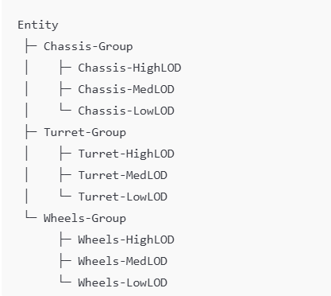
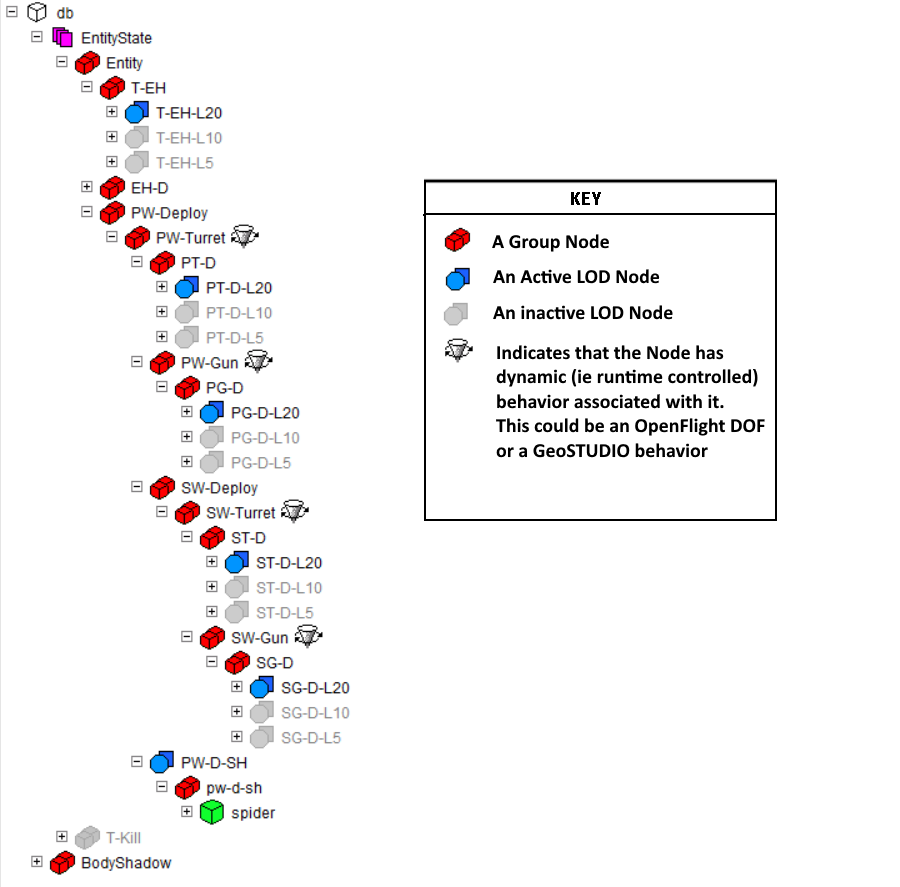

# Bringing OpenFlight/GeoSTUDIO-Style, Per-Part LODs into glTF with GEO_LOD

In visual-simulation toolchains (e.g. OpenFlight, Aechelon, Geo STUDIO), it’s routine to define **per-part** LOD variants directly in the model hierarchy. For example, a tank’s:

- **Chassis** split into high/med/low meshes under one grouping node  
- **Turret** under another grouping node  
- **Wheels** under yet another grouping node  

—all within a single file. No “root-only” swapping, and no need to carve your model into separate glTFs for each LOD.

By contrast, glTF’s built-in LOD patterns (e.g. `MSFT_lod`) expect a **single** node that _is_ the switcher, listing mesh indices. That works, but it can’t express “here’s a chassis with three mesh children” or “here’s a turret behavior with its own LOD children” in one neat file.

Enter **GEO_LOD**—a small vendor extension you attach to **any** grouping node (with no `mesh` of its own) whose **children** (the entire subtree) are the LOD variants for that part. Your loader/runtime then activates the matching subtree based on distance or screen-coverage `switchIn` & `switchOut` criteria. Any dynamic transform applied above the LOD node automatically propagates to the active variant.

---

Each **Group** above holds three mesh-children for High/Med/Low LOD. You can still animate or transform the group (rotate turret, deploy wheels, etc.) without rebinding when the LOD changes.

---

## Proposed JSON Schema

For the full machine-readable schema, see [`schema.json`](schema.json):

---

## Authoring Example (DISTANCE)

{
  "asset": { "version": "2.0" },
  "extensionsUsed": ["GEO_LOD"],
  "nodes": [
    {
      "name": "Chassis-L20",
      "extensions": {
        "GEO_LOD": {
          "mode": "DISTANCE",
          "switchinout": [50.0, 0.0]
        }
      },
      "children": [3]
    },
    {
      "name": "Chassis-L10",
      "extensions": {
        "GEO_LOD": {
          "mode": "DISTANCE",
          "switchinout": [150.0, 50.0]
        }
      },
      "children": [4]
    },
    {
      "name": "Chassis-L5",
      "extensions": {
        "GEO_LOD": {
          "mode": "DISTANCE",
          "switchinout": [1000000, 150.0]
        }
      },
      "children": [5]
    },
    { "name": "Chassis-High-Mesh", "mesh": 0 },
    { "name": "Chassis-Med-Mesh",  "mesh": 1 },
    { "name": "Chassis-Low-Mesh",  "mesh": 2 }
  ],
  "meshes": [
    { "primitives": [{ "attributes": {} }] },
    { "primitives": [{ "attributes": {} }] },
    { "primitives": [{ "attributes": {} }] }
  ]
}

---

## Authoring Example (SCREEN_COVERAGE)

{
  "asset": { "version": "2.0" },
  "extensionsUsed": ["GEO_LOD"],
  "nodes": [
    {
      "name": "Wheel-Large",
      "extensions": {
        "GEO_LOD": {
          "mode": "SCREEN_COVERAGE",
          "switchinout": [0.5, 0.2]
        }
      },
      "children": [1]
    },
    { "name": "Wheel-Large-Mesh", "mesh": 0 }
  ],
  "meshes": [
    { "primitives": [{ "attributes": {} }] }
  ]
}

---

## Loader Integration (THREE.js)

// Distance metric
function cameraDistanceToNode(node, camera) {
  const nodePos = new THREE.Vector3();
  node.getWorldPosition(nodePos);
  return nodePos.distanceTo(camera.position);
}

// Screen-coverage metric
function computeCoverageNDC(node, camera) {
  const sphere = node.geometry.boundingSphere.clone()
    .applyMatrix4(node.matrixWorld);
  const ndcCenter = sphere.center.clone().project(camera);

  const worldEdge = sphere.center.clone().add(
    new THREE.Vector3(sphere.radius, 0, 0)
      .applyMatrix4(node.matrixWorld)
  );
  const ndcEdge = worldEdge.clone().project(camera);

  const ndcRadius = ndcCenter.distanceTo(ndcEdge);
  return Math.PI * ndcRadius * ndcRadius;
}

// Recursive render traversal
function renderNode(node, camera) {
  const ext = node.userData.GEO_LOD;
  if (ext) {
    const metric = (ext.mode === "DISTANCE")
      ? cameraDistanceToNode(node, camera)
      : computeCoverageNDC(node, camera);

    const [inT, outT] = ext.switchinout;
    const active = metric <= inT && metric > outT;
    node.visible = active;
    if (!active) return;
  }
  for (const child of node.children) {
    renderNode(child, camera);
  }
}

function updateSceneLOD(root, camera) {
  renderNode(root, camera);
}

---

## Why this works

LOD nodes gate traversal—grouping nodes carry thresholds and have no mesh.

Mesh nodes render when reached.

Nested LODs work anywhere in the scene graph.

Overlap/blending is possible by tuning switchinout ranges.

---

### Trademark notice:

OpenFlight is a trademarks of Presagis Inc. Geo STUDIO is a trademark of Carbon Graphics
